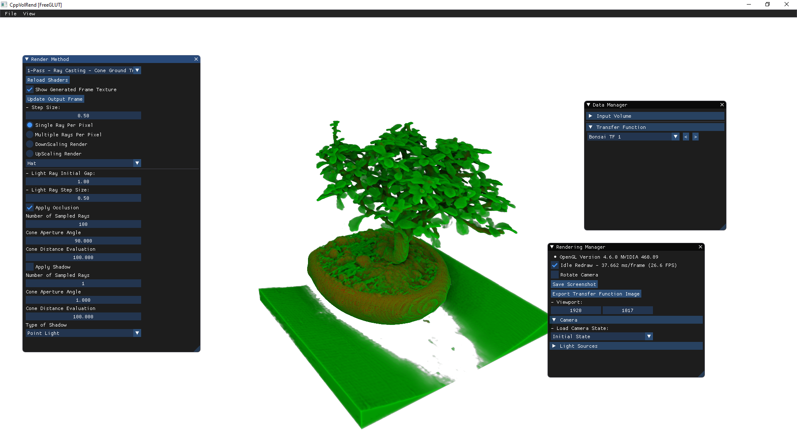

## C++ Volume Rendering

A volume rendering application with different techniques, trying to be as similar as possible to the results from each paper. Any contribution is welcome!

### Project settings

---

* Developed using Visual Studio cmake extension (2017, 2019).

* Using C++ and GLSL

* Uses glew, freeglut/glfw and glm

* Supported Volumes: .raw, .pvm and .syn

* Supported Transfer Functions: 1D Piecewise linear .tf1d

* [Additional data](https://github.com/lquatrin/volume_rendering_data)

### Implemented methods

---

* 1-Pass - Ray Casting
  - Structured Single-pass GLSL Ray Casting

* 1-Pass - Ray Casting - Cone Ground Truth (Steps)
  - Structured Single-pass Ray Casting: Directional Ambient Occlusion and Shadows with Cone Tracing
  - Ray Tracing Ground Truth
  - Implements: 
    - Directional Ambient Occlusion
    - Cone Shadows

* 1-Pass - Ray Casting - Dir. Occlusion Shading
  - Structured Single-pass Ray Casting: Directional Ambient Occlusion and Shadows with Cone Tracing
  - Leonardo Q. Campagnolo, Waldemar Celes. Interactive directional ambient occlusion and shadow computations for volume ray casting. Computers & Graphics, Volume 84, 2019, Pages 66-76, ISSN 0097-8493. doi: 10.1016/j.cag.2019.08.009.
  - Links: [Elsevier](https://www.sciencedirect.com/science/article/abs/pii/S0097849319301372)

* 1-Pass - Ray Casting - Extinction-based
  - Structured Single-pass Ray Casting: Extinction-based shading
  - Schlegel, P, Makhinya, M, Pajarola, R. Extinction-based shading and illumination in gpu volume ray-casting. IEEE Transactions on Visualization and Computer Graphics 2011 Dec;17(12):1795–1802. doi: 10.1109/TVCG.2011.198.
  - Links: [IEEE](https://ieeexplore.ieee.org/document/6064942)
  - Missing: Ambient Occlusion with Color Bleeding
  - Summed Area Table (SAT) built with extinction coefficient (on CPU).

* 1-Pass - Ray Casting - Voxel Cone Tracing
  - Single-GPU version implemented just for render comparison
  - Structured Single-pass Ray Casting: Voxel Cone Tracing Shadows
  - Shih, M., Rizzi, S., Insley, J.A., Uram, T.D., Vishwanath, V., Hereld, M., Papka, M.E., & Ma, K. (2016). Parallel distributed, GPU-accelerated, advanced lighting calculations for large-scale volume visualization. 2016 IEEE 6th Symposium on Large Data Analysis and Visualization (LDAV), 47-55. doi: 10.1109/LDAV.2016.7874309.
  - Links: [IEEE](https://ieeexplore.ieee.org/document/7874309)

* Slice-based - Directional Occlusion
  - Structured Slice-based Texture Mapping: Directional Occlusion Shading Model
  - Schott, M., Pegoraro, V., Hansen, C., Boulanger, K. and Bouatouch, K. (2009), A Directional Occlusion Shading Model for Interactive Direct Volume Rendering. Computer Graphics Forum, 28: 855-862. doi:10.1111/j.1467-8659.2009.01464.x.
  - Links: [ACM](https://dl.acm.org/doi/10.1111/j.1467-8659.2009.01464.x)

### Screenshot

---

